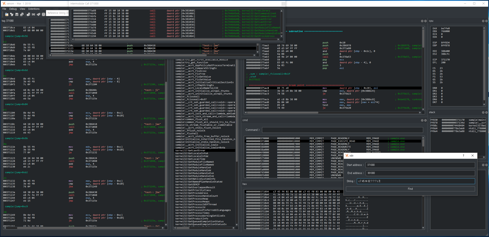

	

XDV : eXtension type Disassembly & Debug Viewer
-------

XDV is disassembler or debugger that works based on the extension plugin. 

 

Supported Architectures
-------
<table>
  <tr> 
    <td align="center" colspan="2"><b> Architecture </b></td>
	<td align="center"><b> Static analysis </b></td>
	<td align="center"><b> Data export </b></td>
  </tr>
  <tr>
    <td align="center"> x86 </td>
    <td align="center"></td>
    <td align="center"></td>
    <td align="center"></td>	
  </tr>
  <tr>
    <td align="center"> x64 (aka x86_64, AMD64) </td>
    <td align="center"></td>
    <td align="center"></td>
    <td align="center"></td>	
  </tr>
  <tr>
    <td align="center"> ARM </td>
    <td align="center"></td>	
    <td align="center"></td>	
    <td align="center"></td>	
  </tr>	
</table>

Supported File Formats
-------
<table>
  <tr> 
    <td align="center" colspan="2"><b> File format </b></td>
  </tr>
  <tr> 
    <td align="center"> Windows full user-mode dump file </td>
    <td align="center"></td>
  </tr>
  <tr> 
    <td align="center"> Windows PE file </td>
    <td align="center"></td>	
  </tr>
  <tr> 
    <td align="center"> Binary file </td>
    <td align="center"></td>	
  </tr> 
</table>

Supported OSes & Debuggers
-------
<table>
  <tr>
    <td align="center"><b> OS </b></td>
    <td align="center" colspan="3"><b> Debugger </b></td>
  </tr>
  <tr>
    <td align="center"><b> Windows </b></td>
    <td align="center"></td>
    <td align="center"></td>	
    <td align="center"></td>
  </tr>  
</table>

Documentation
-------
* [Wiki](https://github.com/xdvre/xdvre/wiki)

Developers
-------
* [Park Seong Bin](https://github.com/0a777h)

Dependencies
-------
* [Capstone Engine](https://github.com/aquynh/capstone)
* [Unicorn Engine](https://github.com/unicorn-engine/unicorn)
* [Keystone Engine](https://github.com/keystone-engine/keystone)
* [x64dbg](https://github.com/x64dbg/x64dbg)
* [Cheat Engine](https://github.com/cheat-engine/cheat-engine)
* [diStorm3](https://github.com/gdabah/distorm)

Special Thanks To ...
-------
* [Yonggoo Noh](https://github.com/ygnoh)
* [Chae Jong Bin](https://github.com/Necrosys)
* [Junyoung Kim](https://github.com/junyoungKimGit)
* [Jaehoon Ahn](https://github.com/dkswognsdi)
* [Jeonghoon Kim](https://github.com/ppiizzaa)
